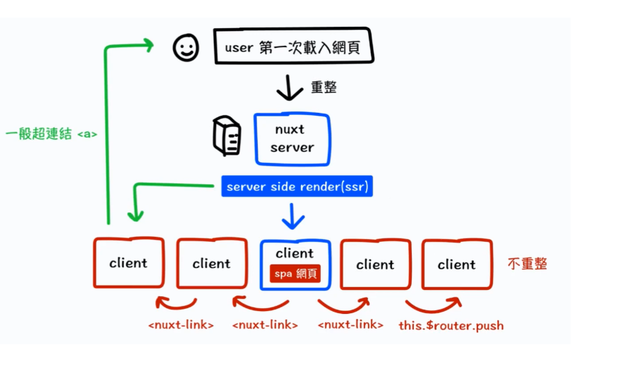

## Nuxt SSR 與 生命週期

Tina

---

#### 為何選這個主題
---
##

---

##

---

|        |  SSR  |  CSR  |
|  ----  |  ----  | ----  |
|  原理  | 直接由伺服器回傳完整HTML給前端顯示  | 由伺服器回傳HTML.CSS.JS，再由瀏覽器解讀檔案並渲染頁面 |
|  server負荷  | 高  | 低 |
|  頁面切換  | 重新刷新頁面  | 切換元件 |
|  SEO  |  佳  | 差 |

---

#### 檢視網頁原始碼
---

#### Nuxt(SSR+SPA)

---

---

#### 生命週期

---

#### asyncData與fetch
- asyncData return 出來的 data 會 取代原本的 data() 
- asyncData執行完才會往下執行created、fetch
- asyncData無法取得this，created、fetch可以
- 第一次載入伺服器端都會等asyncData及fetch兩個函式都跑完才顯示畫面
- 但如果是用NUXT-LINK轉頁，就可以明顯看見asyncData跑完才會顯示畫面，但fetch則是先進入畫面後等待非同步結束再把資料渲染出來
- 可參考`$fetchState.pending`可以加入loading
- asyncData載入失敗會直接阻止路由
- `$fetchState.error`加入錯誤畫面
---

#### created

- created及beforeCreate會在伺服器端及客戶端各執行一次，共兩次
- created是否會在後端渲染會看它非同步完成的時間是否於fetch之前或同時結束

---

#### 服務端
- [服務端的上下文-context參數](https://nuxtjs.org/docs/internals-glossary/context/)
- 在服務端生命週期中無法拿到客戶端訊息(如:window)
- 在component元件中不會執行asyncData、middleware、validate
---

#### 加入keep alive

- 無destroyed
- 第二次進入相同畫面時，不會觸發created及fetch
- 一樣可使用activated及deactivated

---
#### 參考資料
- [BookStack - Nuxt.js 生命週期](http://192.168.99.115/books/web-team-%E5%82%B3%E6%89%BF%E8%88%87%E5%88%86%E4%BA%AB/page/nuxtjs-%E7%94%9F%E5%91%BD%E9%80%B1%E6%9C%9F)
- [Nuxt官網 - Server side rendering](https://nuxtjs.org/docs/concepts/server-side-rendering)
- [Nuxt官網 - Nuxt Lifecycle](https://nuxtjs.org/docs/concepts/nuxt-lifecycle)
- [不只懂 Vue 語法：以 Vue 和 Nuxt 為例，說明 SPA 和 SSR 的概念？](https://ithelp.ithome.com.tw/articles/10262891)
- [十五分鐘讓你快速搞懂 NUXT SSR 運作原理 | HiSKIO 程式語言線上教學](https://www.youtube.com/watch?v=IHyOXnD8UGI)